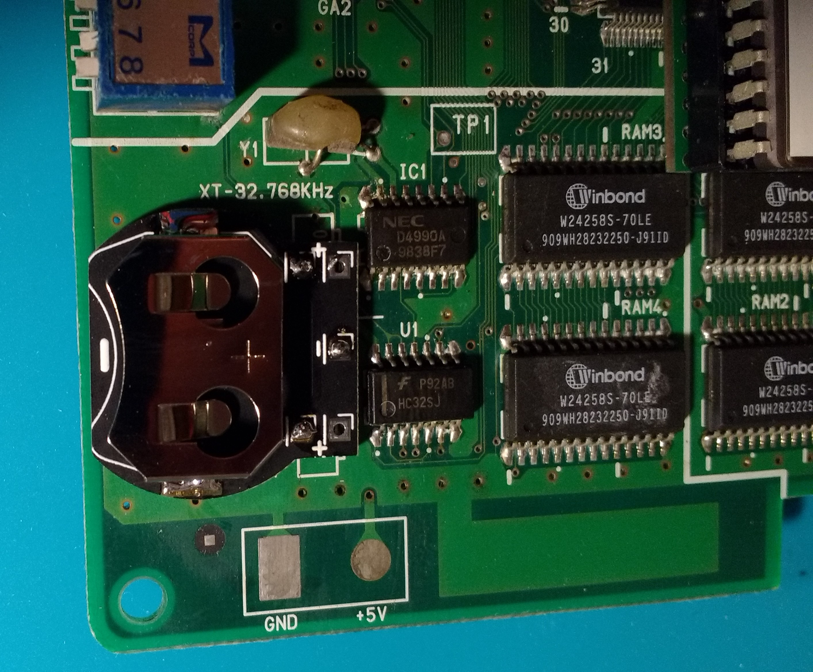
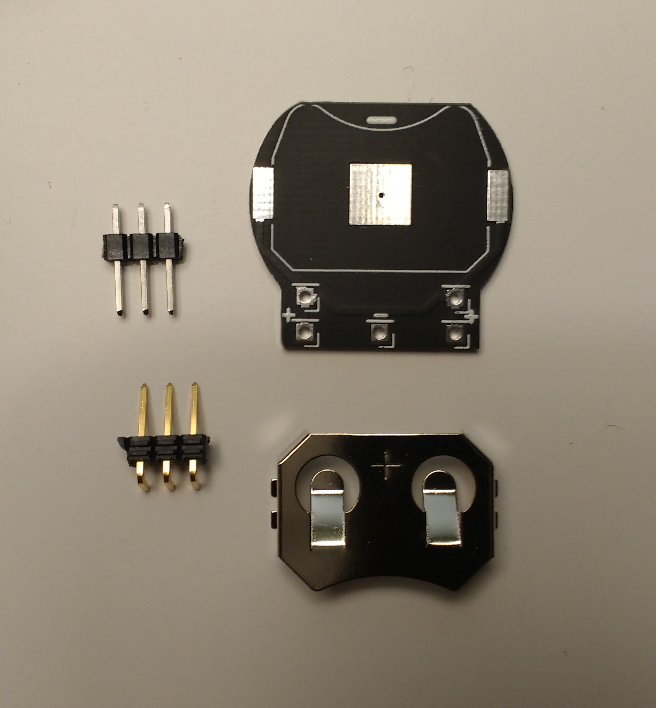
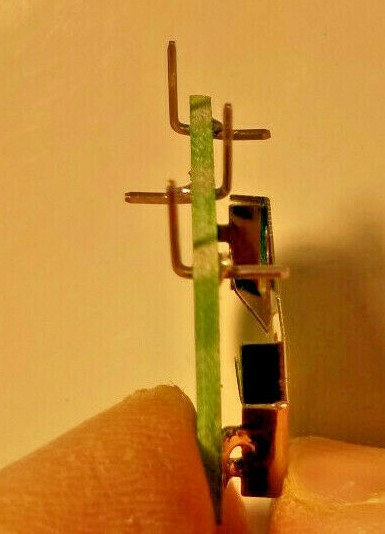

THIS PROJECT IS PROVIDED "AS IS", WITHOUT WARRANTY OF ANY KIND, EXPRESS OR IMPLIED, INCLUDING BUT NOT LIMITED TO THE WARRANTIES OF MERCHANTABILITY, FITNESS FOR A PARTICULAR PURPOSE AND NONINFRINGEMENT. IN NO EVENT SHALL I BE LIABLE FOR ANY CLAIM, DAMAGES OR OTHER LIABILITY, WHETHER IN AN ACTION OF CONTRACT, TORT OR OTHERWISE, ARISING FROM, OUT OF OR IN CONNECTION WITH THIS PROJECT.

<b>This battery holder is for replacing the battery coin of the MVS:</b>
- MV1-C (the battery holder can be mounted vertically only)
- MV1-B (the battery holder can be mounted vertically or horizontally)

  

  

<b>Pictures of the all the Parts:</b> 
https://github.com/NEO-JAMMA/Neo-Geo_MVS_Projects/tree/main/Battery/Parts

  

<b>Parts description:</b>
- 1 * SMD Button Coin Cell CR2032 battery holder
- 3 * Header 1 pin 2.54mm 90 degree right angle (for vertical mount)
- or
- 3 * Header 1 pin 2.54mm (for horizontal mount)

<b>Optional parts:</b>
- 1 * LIR2032 3.6V Li-ion rechargeable battery
- or
- 1 * CR2032 3V none rechargeable battery

<b>Soldering of the header pins for vertical mount:</b>

  

<b>Gerber files:</b> 
https://github.com/NEO-JAMMA/Neo-Geo_MVS_Projects/tree/main/Battery/Gerber

<b>Kicad source:</b> 
https://github.com/NEO-JAMMA/Neo-Geo_MVS_Projects/tree/main/Battery/Kicad

<b>CR2032 vs LIR2032</b> 
if you want to use a CR2032 none rechargeable battery it is important to remove some components please check the Jamma Nation X tutorials for more information:
https://www.jamma-nation-x.com/jammax/tutorials.html
