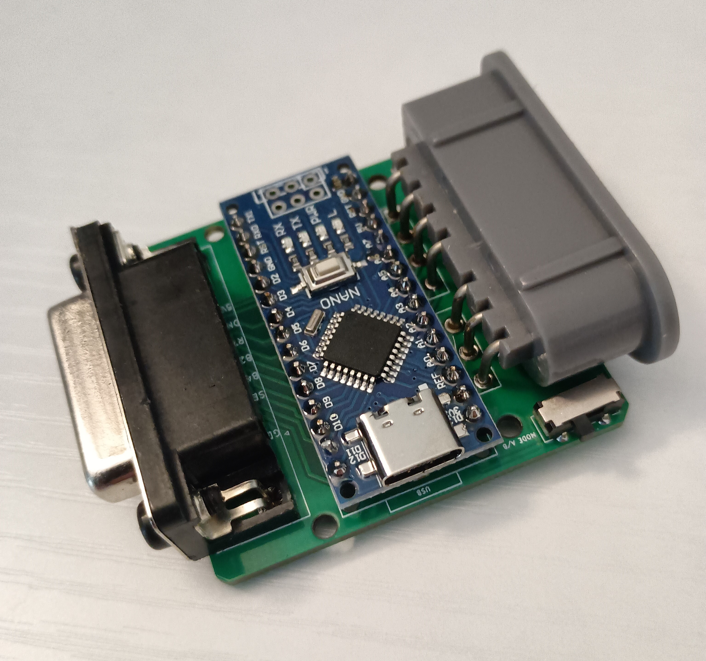
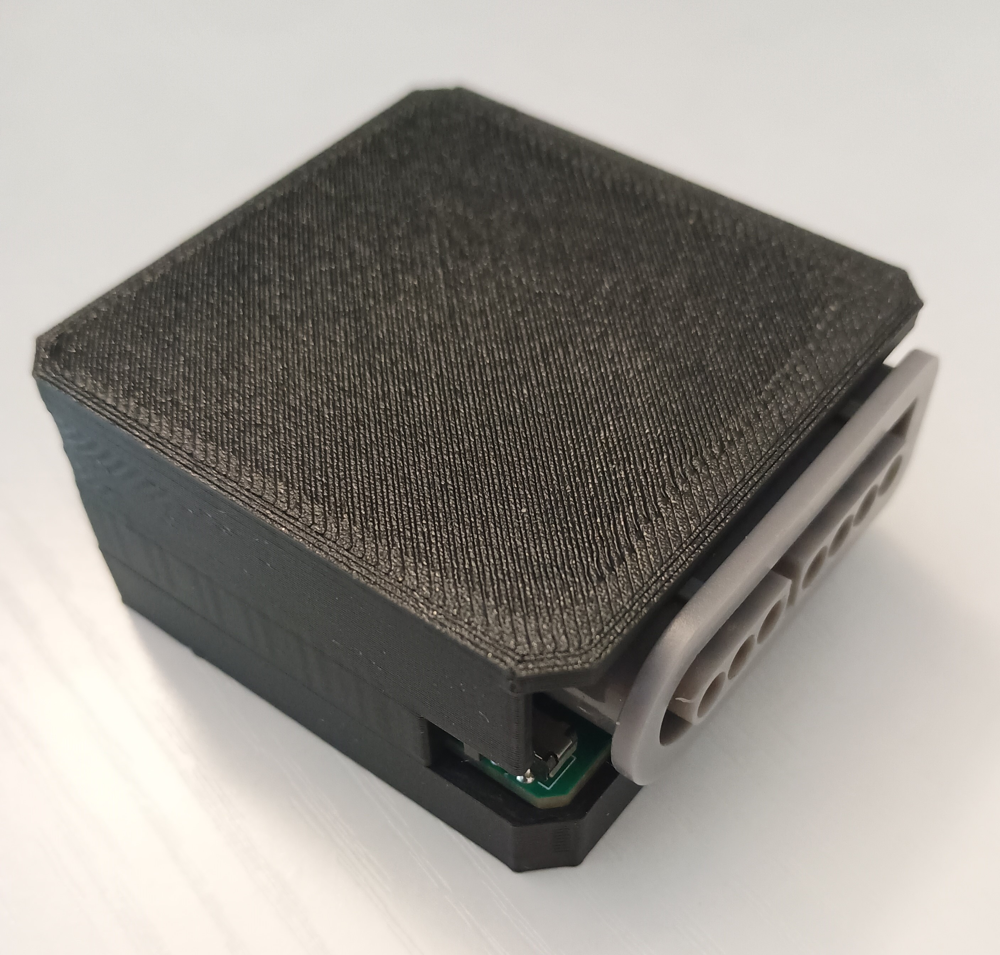
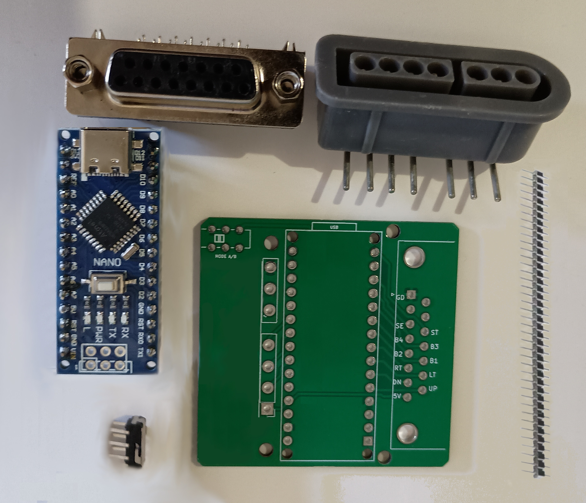
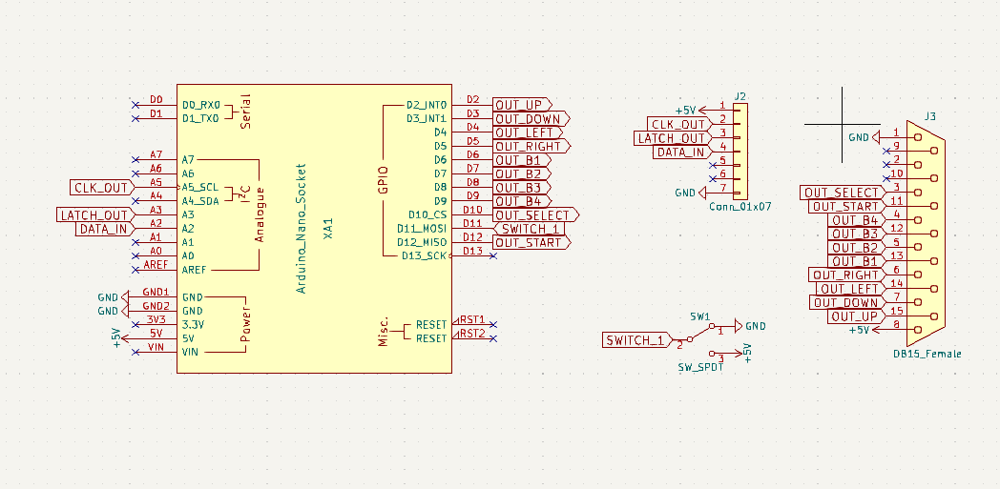
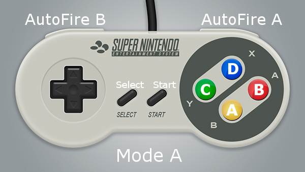
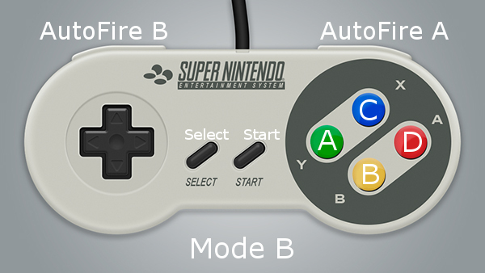

THIS PROJECT IS PROVIDED "AS IS", WITHOUT WARRANTY OF ANY KIND, EXPRESS OR IMPLIED, INCLUDING BUT NOT LIMITED TO THE WARRANTIES OF MERCHANTABILITY, FITNESS FOR A PARTICULAR PURPOSE AND NONINFRINGEMENT. IN NO EVENT SHALL I BE LIABLE FOR ANY CLAIM, DAMAGES OR OTHER LIABILITY, WHETHER IN AN ACTION OF CONTRACT, TORT OR OTHERWISE, ARISING FROM, OUT OF OR IN CONNECTION WITH THIS PROJECT.

<b>SNES to Neo-Geo Controller Adapter</b>

  

  

<b>This converter is design to works with MVS supergun</b>
https://github.com/NEO-JAMMA/Neo-Geo_MVS_Projects/tree/main/Supergun/README.md

<b>Pictures of the all the Parts:</b> 
https://github.com/NEO-JAMMA/Neo-Geo_MVS_Projects/tree/main/SNESControllerAdapter/Parts

  

<b>Parts description:</b>
- 1 * Arduino Nano (Cheap clone will works fine)
- 2 * Header 15 pins 2.54mm
- 1 * Micro Slide 90 Degree Switch 6 Pins DPDT PCB Mount
- 1 * Super Nintendo/Super Famicom controller port 90 Degree 7 Pin Female (if the controller port is reversed it is possible to reverse the pins by polling them and turning them to a 180 degree angle)
- 1 * DR15 15 Pins female right angle (D-SUB 15)
- 2 * Flat M3 Screws to replace the long hexagonal screw of DR15 15 Pins female port (to secure the front metal connector)

<b>Optional parts:</b>
- 4 * M2 Screws 25mm to 28mm long (For 3D printed case)

<b>Gerber files:</b> 
https://github.com/NEO-JAMMA/Neo-Geo_MVS_Projects/tree/main/SNESControllerAdapter/Gerber

<b>Arduino code:</b> 
https://github.com/NEO-JAMMA/Neo-Geo_MVS_Projects/tree/main/SNESControllerAdapter/ArduinoCode

<b>3D Printed case:</b> 
https://github.com/NEO-JAMMA/Neo-Geo_MVS_Projects/tree/main/SNESControllerAdapter/3D_Case

<b>Kicad source:</b> 
https://github.com/NEO-JAMMA/Neo-Geo_MVS_Projects/tree/main/SNESControllerAdapter/Kicad

  

<b>Controller Modes:</b> 
The mode switch on the side of the PCB toggle the button mappings

  

  

<b>Other:</b>
- The controller adapter will have work with a Neo-Geo AES unfortunately the DB15 port is too short for Neo-Geo AES controller port.
- To program the Arduino Nano please refer to https://docs.arduino.cc/tutorials/nano/nano-getting-started/.
- The controller adapter works with Super Nintendo or Super Famicom controller (Cheap clones are fine).
