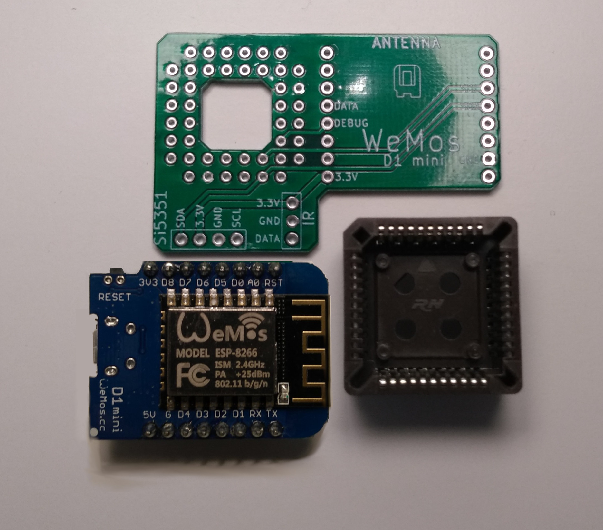

THIS PROJECT IS PROVIDED "AS IS", WITHOUT WARRANTY OF ANY KIND, EXPRESS OR IMPLIED, INCLUDING BUT NOT LIMITED TO THE WARRANTIES OF MERCHANTABILITY, FITNESS FOR A PARTICULAR PURPOSE AND NONINFRINGEMENT. IN NO EVENT SHALL I BE LIABLE FOR ANY CLAIM, DAMAGES OR OTHER LIABILITY, WHETHER IN AN ACTION OF CONTRACT, TORT OR OTHERWISE, ARISING FROM, OUT OF OR IN CONNECTION WITH THIS PROJECT.

<b>ESP8266 Adapter for GBS8200</b>

  

<b>This adapter is for mounting an ESP8266 to a GBS8200 with a custom Firmware:</b> 
https://ramapcsx2.github.io/gbs-control 
https://github.com/ramapcsx2/gbs-control

<b>Pictures of the all the Parts:</b> 

  

<b>Parts description:</b>
- 1 * PLCC44 socket
- 1 * Wemos D1 mini esp8266

<b>Socket Preparation:</b> 
The socket support must be cut to really fit tight to the IC

  

<b>Gerber files:</b> 
https://github.com/NEO-JAMMA/Neo-Geo_MVS_Projects/tree/main/Esp8266ToGbs8200/Gerber

<b>3D Printed case:</b> 
https://github.com/NEO-JAMMA/Neo-Geo_MVS_Projects/tree/main/Esp8266ToGbs8200/3D_Case

<b>Kicad source:</b> 
https://github.com/NEO-JAMMA/Neo-Geo_MVS_Projects/tree/main/Esp8266ToGbs8200/Kicad

  

  

  

<b>Programming of the Esp8266:</b> 
https://ramapcsx2.github.io/gbs-control/Wiki/Software-Setup.html
