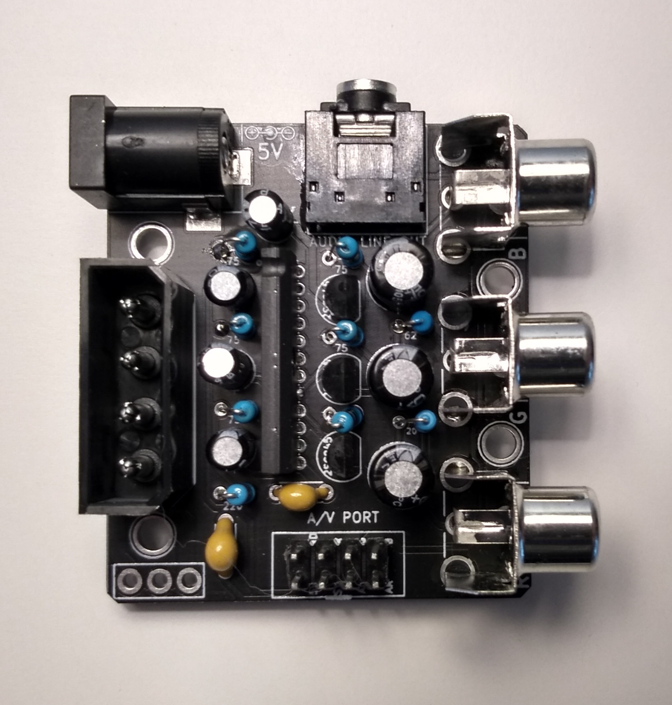

THIS PROJECT IS PROVIDED "AS IS", WITHOUT WARRANTY OF ANY KIND, EXPRESS OR IMPLIED, INCLUDING BUT NOT LIMITED TO THE WARRANTIES OF MERCHANTABILITY, FITNESS FOR A PARTICULAR PURPOSE AND NONINFRINGEMENT. IN NO EVENT SHALL I BE LIABLE FOR ANY CLAIM, DAMAGES OR OTHER LIABILITY, WHETHER IN AN ACTION OF CONTRACT, TORT OR OTHERWISE, ARISING FROM, OUT OF OR IN CONNECTION WITH THIS PROJECT.

<b>Supergun for all MVS:</b> 
https://github.com/NEO-JAMMA/Neo-Geo_MVS_Projects/tree/main/Supergun

  

  

<b>RGB Csync to YPbPr NTSC Converter</b> 
https://github.com/NEO-JAMMA/Neo-Geo_MVS_Projects/tree/main/RGBsToYPrBr

  

<b>Battery holder for MV1-C and MV1-B:</b> 
https://github.com/NEO-JAMMA/Neo-Geo_MVS_Projects/blob/main/Battery/README.md

  

<b>Stereo mod is for MV1-B, MV1-A, and MV1FZ:</b> 
https://github.com/NEO-JAMMA/Neo-Geo_MVS_Projects/blob/main/StereoMod/README.md

  

<b>ESP8266 Adapter for GBS8200</b> 
https://github.com/NEO-JAMMA/Neo-Geo_MVS_Projects/blob/main/Esp8266ToGbs8200/README.md

  

