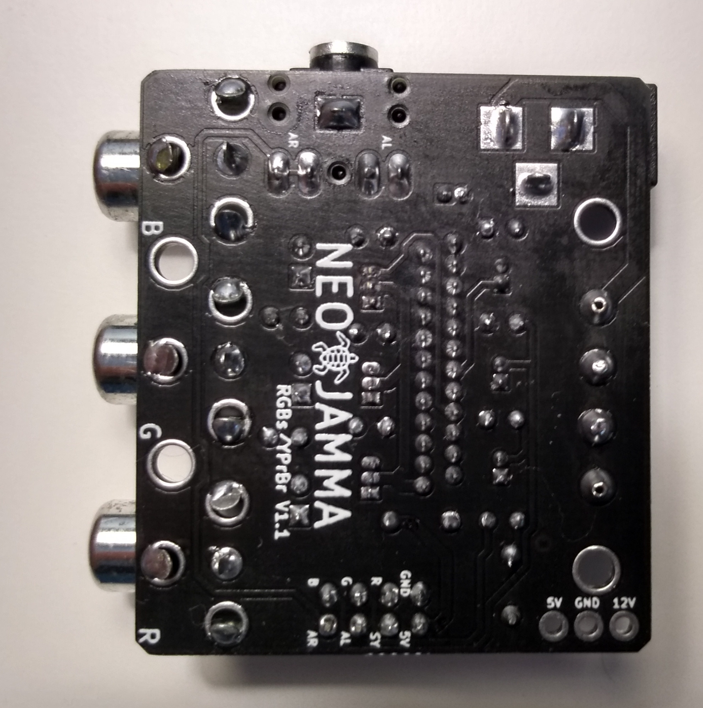
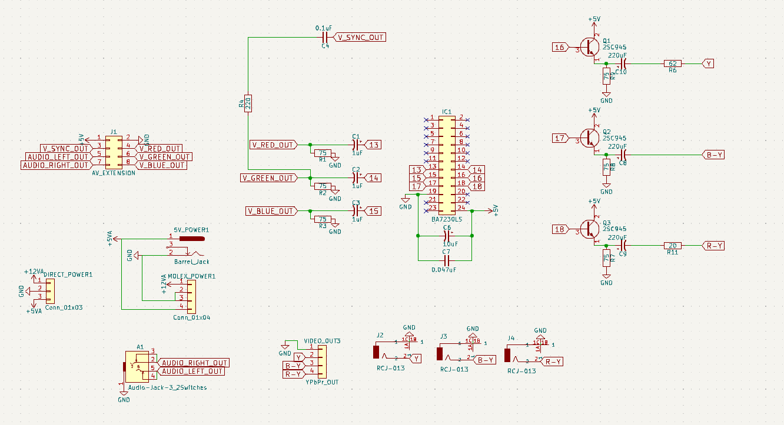

THIS PROJECT IS PROVIDED "AS IS", WITHOUT WARRANTY OF ANY KIND, EXPRESS OR IMPLIED, INCLUDING BUT NOT LIMITED TO THE WARRANTIES OF MERCHANTABILITY, FITNESS FOR A PARTICULAR PURPOSE AND NONINFRINGEMENT. IN NO EVENT SHALL I BE LIABLE FOR ANY CLAIM, DAMAGES OR OTHER LIABILITY, WHETHER IN AN ACTION OF CONTRACT, TORT OR OTHERWISE, ARISING FROM, OUT OF OR IN CONNECTION WITH THIS PROJECT.

<b>RGB Csync to YPbPr NTSC Converter</b>

  

<b>This Converter is design for this Supergun:</b> 
https://github.com/NEO-JAMMA/Neo-Geo_MVS_Projects/tree/main/Supergun

<b>Pictures of the all the Parts:</b> 

  

<b>Parts description:</b>
- 3 * 16V 220UF 6x7mm Electrolytic Capacitors
- 3 * 50V 1UF 4x7mm Electrolytic Capacitors
- 1 * 50V 10UF 4x7mm Electrolytic Capacitors
- 1 * 0.1UF Capacitors (104)
- 1 * 0.047UF Capacitors (473)
- 3 * 2sc945 transistors
- 1 * NTSC signal encoder BA7230LS
- 3 * PCB Mount RCA Female Connector
- 1 * 3F07 Audio Jack Connector PCB 5 Pins
- 1 * Header 8 Pins Male Socket Double Row 2.54mm (AV connection to the Supergun)
- 1 * 8 pins Dupont Cable Female Connector Wire 2.54mm Pitch 30cm (AV connection to the Supergun)
- 9 * Resistors
    - 6 * 75 Ohm
    - 2 * 20 Ohm
    - 1 * 62 Ohm

<b>Optional parts for powering the Supergun from the converter:</b>
- 3 * 18 gauge wires (12 Volt, 5 Volt, and ground connection to the Supergun)
- 1 * Molex 4 pins (PC connector)(12 Volt and 5 Volt connection to the Supergun)
- 1 * Power Jack Socket 2.1mm x 5.5mm Barrel-Type PCB Mount (5 Volt connection to the Supergun)

<b>Gerber files:</b> 
https://github.com/NEO-JAMMA/Neo-Geo_MVS_Projects/tree/main/RGBsToYPrBr/Gerber

<b>Kicad source:</b> 
https://github.com/NEO-JAMMA/Neo-Geo_MVS_Projects/tree/main/RGBsToYPrBr/Kicad

  

  

  

<b>Other:</b>
- The converter can also power the Supergun (see optional parts section)
- Acknowledgements to Ace, Zebidee and all variations available on the web which helped me for the design.
- Works only with NTSC TV not PAL/SECAM
- Only dislpay in 240p. For modern HDMI TV you need an upscaler like:
    - OSSC (https://www.retrorgb.com/ossc.html)
    - GBS8200 (https://github.com/ramapcsx2/gbs-control)
