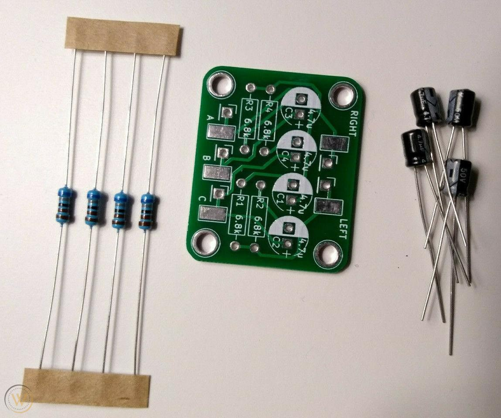
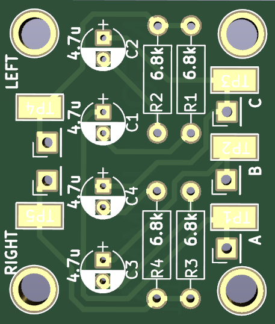

THIS PROJECT IS PROVIDED "AS IS", WITHOUT WARRANTY OF ANY KIND, EXPRESS OR IMPLIED, INCLUDING BUT NOT LIMITED TO THE WARRANTIES OF MERCHANTABILITY, FITNESS FOR A PARTICULAR PURPOSE AND NONINFRINGEMENT. IN NO EVENT SHALL I BE LIABLE FOR ANY CLAIM, DAMAGES OR OTHER LIABILITY, WHETHER IN AN ACTION OF CONTRACT, TORT OR OTHERWISE, ARISING FROM, OUT OF OR IN CONNECTION WITH THIS PROJECT.

<b>This stereo mod is for :</b>
- MV1-B
- MV1-A
- MV1FZ

  

<b>Pictures of the all the Parts:</b> 

  

<b>Parts description:</b>
- 4 * Resistors 1/4 watt 6.8K Ohm
- 4 * 50V 4.7UF 4x7mm Electrolytic Capacitors

<b>Gerber files:</b> 
https://github.com/NEO-JAMMA/Neo-Geo_MVS_Projects/tree/main/StereoMod/Gerber

<b>Kicad source:</b> 
https://github.com/NEO-JAMMA/Neo-Geo_MVS_Projects/tree/main/StereoMod/Kicad

  

<b>Wiring</b> 
Please check the Jamma Nation X tutorials for more information:
https://www.jamma-nation-x.com/jammax/tutorials.html
