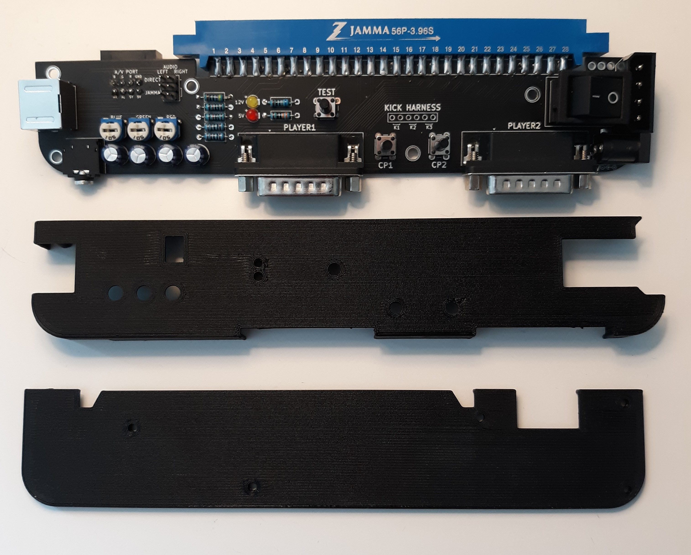
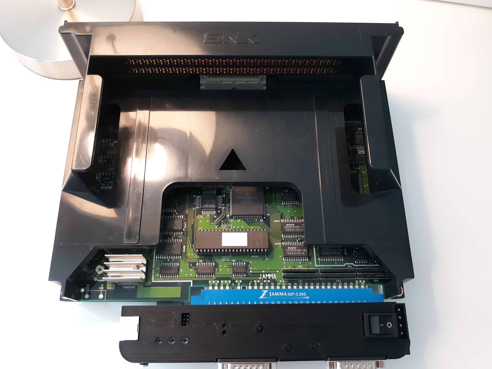
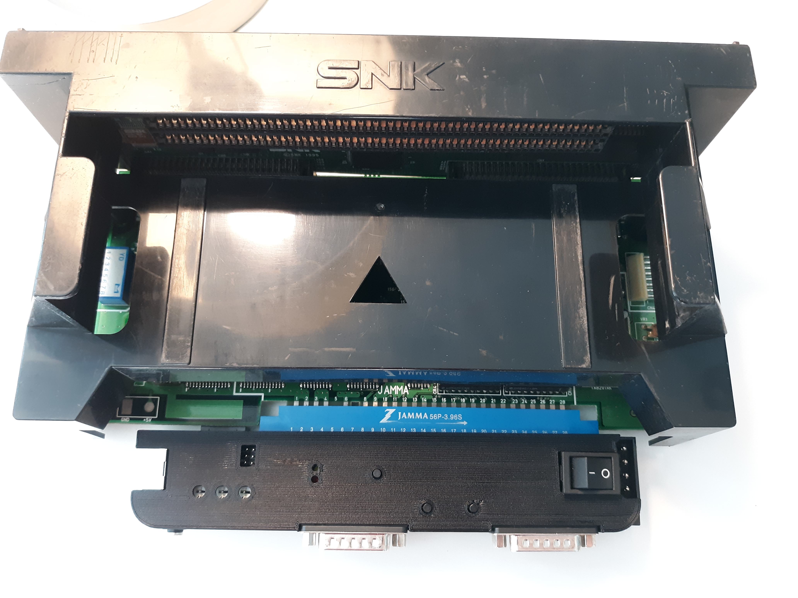
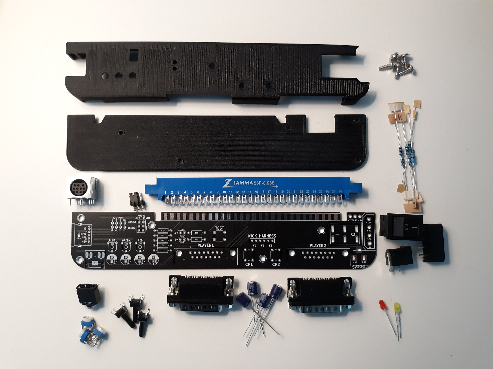
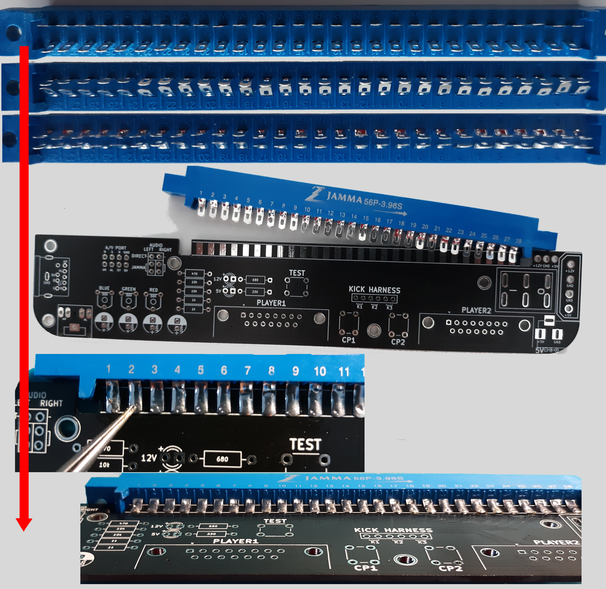
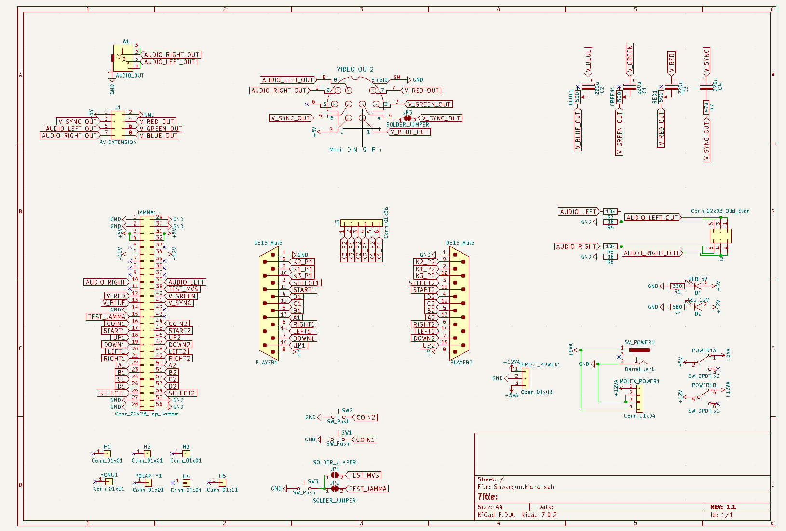
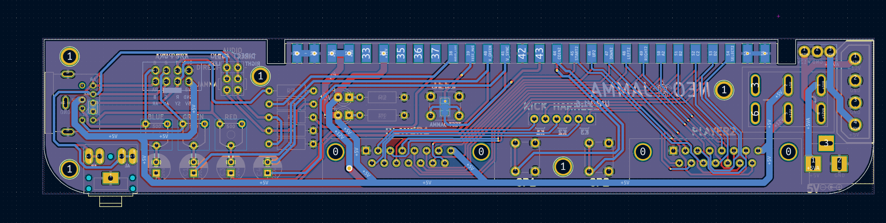
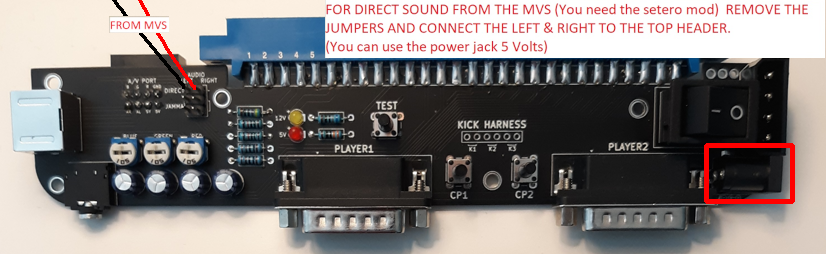
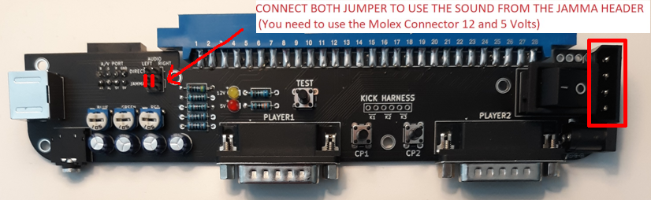
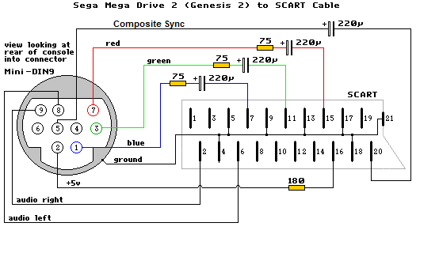

THIS PROJECT IS PROVIDED "AS IS", WITHOUT WARRANTY OF ANY KIND, EXPRESS OR IMPLIED, INCLUDING BUT NOT LIMITED TO THE WARRANTIES OF MERCHANTABILITY, FITNESS FOR A PARTICULAR PURPOSE AND NONINFRINGEMENT. IN NO EVENT SHALL I BE LIABLE FOR ANY CLAIM, DAMAGES OR OTHER LIABILITY, WHETHER IN AN ACTION OF CONTRACT, TORT OR OTHERWISE, ARISING FROM, OUT OF OR IN CONNECTION WITH THIS PROJECT.

  

  

<b>This supergun works with all MVS and Atomiswave (use the Kick Harness pins for Atomiswave)</b>

  

  

  

<b>Pictures of the Parts:</b> 
https://github.com/NEO-JAMMA/Neo-Geo_MVS_Projects/tree/main/Supergun/Parts

  

<b>Parts:</b>
- 1 * 28 pins Jamma Connector
- 3 * RM065 500 Ohm Potentiometer
- 3 * Button 6mm x 6mm x 12.5mm
- 4 * 16V 220UF 6x7mm Electrolytic Capacitors
- 1 * KCD2-202 DPDT Switch 6 pins 21X15mm
- 1 * Mini Din9 9 Pins Connector
- 1 * Molex 4 pins (PC connector) (Optional With Direct Stereo Audio/5 volts mod)
- 1 * Power Jack Socket 2.1mm x 5.5mm Barrel-Type PCB Mount
- 2 * Header 3 pins 2.54mm
- 2 * DR25 25 Pins Male right angle (D-SUB 15)
- 2 * Led 3mm (Orange & Red)
- 7 * Resistors
    - 1 * 470 Ohm
    - 1 * 330 Ohm
    - 1 * 680 Ohm
    - 2 * 1K Ohm (Optional With Direct Stereo Audio/5 volts mod)
    - 2 * 10K Ohm (Optional With Direct Stereo Audio/5 volts mod)

<b>Optional parts:</b>
- 1 * 2 pins Dupont Cable Female Connector Wire 2.54mm Pitch 30cm (For Stereo Audio connection directly to the MVS)
- 1 * Header 3 pins 2.54mm (For Kick Harness)
- 1 * KF301-2P 5.08mm 2 Pins Connect Terminal Screw (External 5 Volts/12 Volts)
- 1 * Header 8 Pins Male Socket Double Row Right Angle 2.54mm
- 1 * 3F07 Audio Jack Connector PCB 5 Pins
- 5 * M3 ScrewsM3 5mm (For 3D printed case)

<b>Soldering of the jamma header:</b>

  

<b>Gerber files:</b> 
https://github.com/NEO-JAMMA/Neo-Geo_MVS_Projects/tree/main/Supergun/Gerber

<b>3D Printed case:</b> 
https://github.com/NEO-JAMMA/Neo-Geo_MVS_Projects/tree/main/Supergun/3D_Case

<b>Kicad source:</b> 
https://github.com/NEO-JAMMA/Neo-Geo_MVS_Projects/tree/main/Supergun/Kicad

  

  

<b>For the sound:</b>
- If you have the stereo modification on your MVS just put the two wires (left-right) on the "DIRECT" connector. you can power the board by the barrel jack (only 5 volt needed).

  

- if you don't have the stereo modification you need to use the two jumper on "LEFT" and "RIGHT" and you need to use the Molex connector 5V/12V.

  

<b>Comments:</b>
- Depending on your setup you might have to cut/solder the test jumper (usually one slot MVS use the Jamma test pin - Multi-slot use the MVS).
- This Supergun only dislpay in 240p. For HDMI TV you need an upscaler like:
    - OSSC (https://www.retrorgb.com/ossc.html)
    - GBS8200 (https://github.com/ramapcsx2/gbs-control)
- For best image/sound quality use a shielded cable.
- This Supergun is setup for a Genesis/Megadrive 2 cable: 

  

