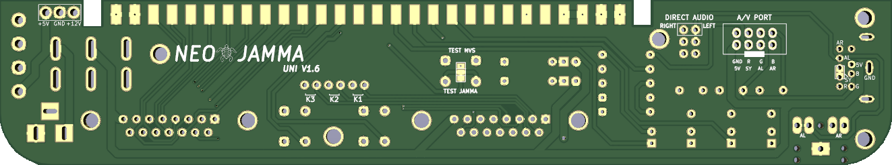

THIS PROJECT IS PROVIDED "AS IS", WITHOUT WARRANTY OF ANY KIND, EXPRESS OR IMPLIED, INCLUDING BUT NOT LIMITED TO THE WARRANTIES OF MERCHANTABILITY, FITNESS FOR A PARTICULAR PURPOSE AND NONINFRINGEMENT. IN NO EVENT SHALL I BE LIABLE FOR ANY CLAIM, DAMAGES OR OTHER LIABILITY, WHETHER IN AN ACTION OF CONTRACT, TORT OR OTHERWISE, ARISING FROM, OUT OF OR IN CONNECTION WITH THIS PROJECT.

<b>Universal MVS Supergun</b>

  

  

<b>This supergun works with all MVS and Atomiswave (use the Kick Harness pins for Atomiswave)</b>

  

  

  

<b>Pictures of the all the Parts:</b> 
https://github.com/NEO-JAMMA/Neo-Geo_MVS_Projects/tree/main/Supergun/Parts

  

<b>Parts description:</b>
- 1 * 28 pins JAMMA Connector
- 3 * RM065 500 Ohm Potentiometer
- 3 * Button 6mm x 6mm x 12.5mm
- 4 * 16V 220UF 6x7mm Electrolytic Capacitors
- 1 * KCD2-202 DPDT Switch 6 pins 21X15mm
- 1 * Mini Din9 9 Pins Connector
- 1 * Molex 4 pins (PC connector) (Optional With Direct Stereo Audio/5 volts mod)
- 1 * Power Jack Socket 2.1mm x 5.5mm Barrel-Type PCB Mount
- 2 * Header 3 pins 2.54mm
- 2 * DR25 25 Pins Male right angle (D-SUB 15)
- 1 * 3F07 Audio Jack Connector PCB 5 Pins
- 2 * Led 3mm (Orange & Red)
- 7 * Resistors
    - 1 * 470 Ohm
    - 1 * 330 Ohm
    - 1 * 680 Ohm
    - 2 * 1K Ohm (Optional With Direct Stereo Audio/5 volts mod)
    - 2 * 10K Ohm (Optional With Direct Stereo Audio/5 volts mod)

<b>Optional parts:</b>
- 1 * 2 pins Dupont Cable Female Connector Wire 2.54mm Pitch 30cm (For Stereo audio connection directly to the MVS)
- 1 * Header 3 pins 2.54mm (For Kick Harness)
- 1 * KF301-2P 5.08mm 2 Pins Connect Terminal Screw (External 5 Volts/12 Volts)
- 1 * Header 8 Pins Male Socket Double Row Right Angle 2.54mm (External A/V signal)
- 5 * M3 Screws 5mm long (For 3D printed case)

<b>Soldering of the JAMMA header:</b>

  

<b>Gerber files:</b> 
https://github.com/NEO-JAMMA/Neo-Geo_MVS_Projects/tree/main/Supergun/Gerber

<b>3D Printed case:</b> 
https://github.com/NEO-JAMMA/Neo-Geo_MVS_Projects/tree/main/Supergun/3D_Case

<b>Kicad source:</b> 
https://github.com/NEO-JAMMA/Neo-Geo_MVS_Projects/tree/main/Supergun/Kicad

  

  

  

<b>Inputs Voltage:</b> 
- The recommended power supply sould be at least 3 amp.
- The supergun can be power by the 5 Volts Barrel power jack (2.1mm x 5.5mm)(Center positive) or by the 5 volts/12 volts Molex connector depending on the sound configuration. Please see below.

<b>For the sound:</b>
- If you have the direct stereo modification on your MVS just put the two sound wires from the MVS (left-right) on the "DIRECT" connector, no jumper on "LEFT" and "RIGHT" connector. You can power the board by the Barrel power jack only 5 volts are needed.

  

- if you don't have the direct stereo modification (sound comming form the JAMMA connector) you need to use the two jumpers on "LEFT" and "RIGHT" connector and you need to use the Molex connector 5 volts/12 volts.

  

<b>For the video:</b>
- This Supergun only dislpay in 240p. For HDMI TV you need an upscaler like:
    - OSSC (https://www.retrorgb.com/ossc.html)
    - GBS8200 (https://github.com/NEO-JAMMA/Neo-Geo_MVS_Projects/tree/main/Esp8266ToGbs8200)
- The video signal is safe thanks to the 470 Ohm on the video Sync signal.
- For best image/sound quality use a shielded cable.
- The 3 blue potentiometers allow a fine tunning of the RGB colors.
- This Supergun is designed to be used with a Genesis/Megadrive 2 AV cable: 

  

<b>Other:</b>
- Depending on your setup you might have to cut the test jumper on the bottom PCB. Usually one slot MVS use the JAMMA test pin (default) - Multi-slot use the MVS.
- CP1 & CP2 are the coin buttons for player 1 & 2
- On the right to JAMMA connector a 3 pins header (5 volts, ground, and 12 volts) is for external power.
- Near the sound pins is located an extenal 8 pins A/V header for additional A/V outputs.
- For stereo mod please check the Jamma Nation X tutorials for more information:
https://www.jamma-nation-x.com/jammax/tutorials.html
